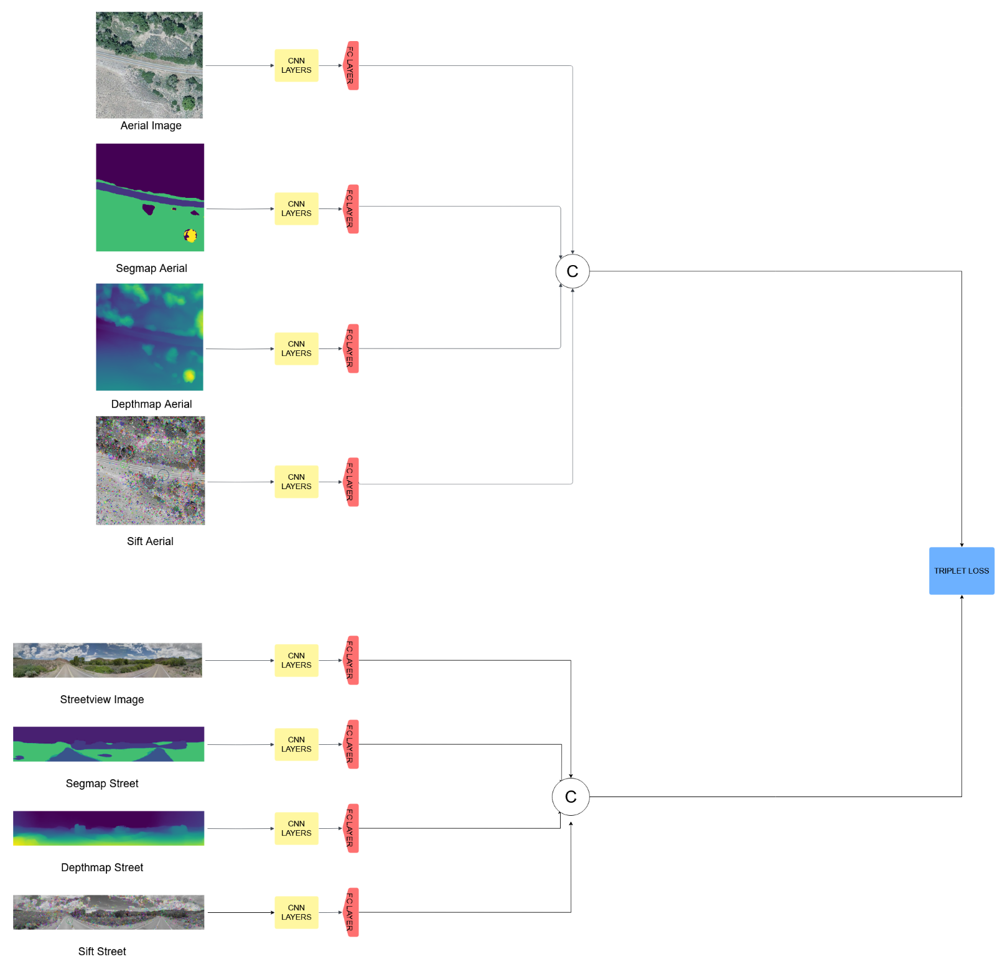

# Computer-Vision-Project-on-Ground-To-Aerial-Matching

The goal of cross-view image based geo-localization is to determine the location of a given street view image by matching it against a collection of geo-tagged satellite images. This task is particularly challenging due to the significant differences in viewpoints and appearances between the two domains. Despite these difficulties, research in this field continues to progress, driven by its potential applications in navigation, autonomous vehicles, urban planning, and emergency response.

In this project we will do an analysis on a Ground-To-Aerial Matching task, we have taken inspiration from an existing paper and wanted to expand the research testing other architectures and giving the model new inputs generated by us in the [utils.ipynb](Utils.ipynb) file.

## Example of New input Generation

### Aerial and Streetview

### Polar

In the [Main](CV_prokect_on_Cross_image_matching.ipynb) notebook we implemented everything else, from the dataset and model creation to the actual training and results.

## The Best model: OCTA-Non-Combined-VGG

## Example of matching:

[photo]

## Results of Best models

| Model               | Combination  | Loss         | Top-1        | Top-1%     | Top-5    | Top-10   | Top-32  |
|---------------------|--------------|--------------|--------------|------------|----------|----------|---------|
| **OCTA-Polar-VGG**  | No Combine   | Triplet + CE | **44.0%**    | **93.5%**  | 93.8%    | 100%     | 100%    |
| **OCTA-Polar-VGG**  | No Combine   | CE           | 43.6%        | 92.7%      | **92.5%**| 100%     | 100%    |
| **OCTA-Polar-VGG**  | No Combine   | Triplet      | 39.5%        | 39.5%      | 95.3%    | **100%** | 100%    |

